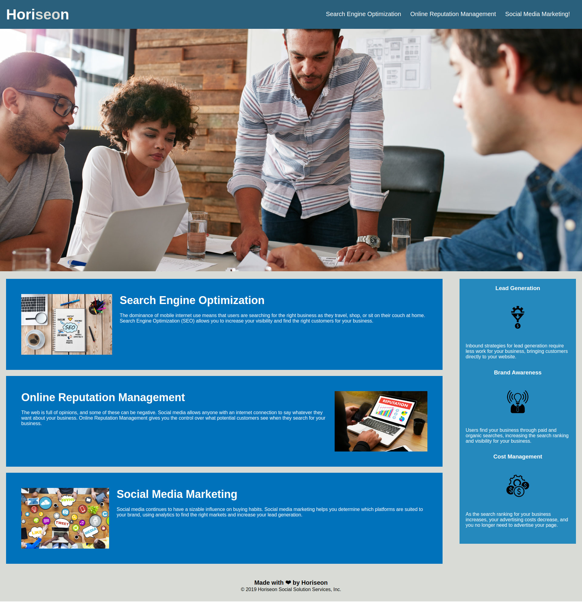

# Bootcamp: UK-VIRT-FE-PT-11-2022-U-LOLC-TWTH-1 Challenge One

## Description

The task in this Challenge is to refactor an existing code to make Horiseon website more accessible, as accessible sites are better positioned in search engines and also can be accessed using assistive technologies.
Some improvements were done in the code, such as making CSS more efficient by consolidating CSS selectors and properties, organizing them to follow the semantic structure of the HTML elements, including comments in the CSS file, adding semantic HTML elements and accessible alt attributes to the image and icon elements, making sure that all links are functioning correctly.

## Installation

N/A

## Usage

The website is built using HTML and CSS. To review the code, open the Chrome DevTools by pressing Command+Option+I (macOS) or Control+Shift+I (Windows). A console panel should open either below or to the side of the webpage in the browser. 

## Credits

N/A

## License

Please refer to the LICENSE in the repo.
